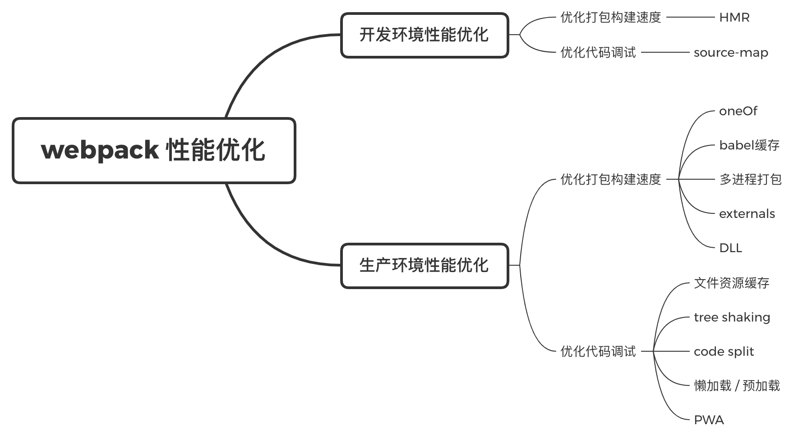

### 一、基本概念

+ entry
+ output - [filename, path] - resolve
+ module - rules - (loader) - [test, use]
+ plugins - 下载 - 引入 - 使用
+ mode
+ devServer

```bash
npm i webpack webpack-cli -D
```

### 二、loader

实例：处理 `css, less 样式文件`、` img 等图片文件` 及`其他资源`的 loader

```js
const { resolve } = require('path')
module.exports = {
  entry: './src/index.js',
  output: {
    filename: 'build.js',
    path: resolve(__dirname, 'build')
  },
  mode: 'development',
  module: {
    rules: [
      {
        test: /\.css$/,
        use: [	// use 执行顺序 从下往上
          // 创建 style 标签，将 js 中样式资源插入，添加到 head 中生效
          'style-loader',
          // 将 css 文件变成 commonjs 模块加载到 js 中，内容是样式字符串
          'css-loader'
        ]
      },
      {
        test: /\.less$/,
        use: [	// use 执行顺序 从下往上
          // 创建 style 标签，将 js 中样式资源插入，添加到 head 中生效
          'style-loader',
          // 将 css 文件变成 commonjs 模块加载到 js 中，内容是样式字符串
          'css-loader',
          // 将 less 文件变成 css 文件
          // npm i less less-loader -D
          'less-loader'
        ]
      },
      {
        // 问题：默认处理不了 html 中 img 图片（使用 html-loader 解决）
        test: /\.(jpg|png|gif)$/,
        // 只有一个 loader 可以直接 loader，不需要使用 use
        // 下载 url-loader file-loader 两个包
        loader: 'url-loader',
        options: {
          // 图片大小小于8kb就会被base64处理
          // 优点：减少请求数量
          // 缺点：图片体积会更大（文件请求速度更慢）
          limit: 8 * 1024,
          // 问题：url-loader 默认使用 ES6 模块化解析
          // 			html-loader 默认使用 commonjs 解析，解析会报错
          // 解决：关闭 ES6 模块化处理
          esModule: false,
          // 给图片重命名，取hash前10位，取图片原扩展名
          name: '[hash:10][.ext]',
          outputPath: 'imgs'
        }
      },
      {
        // 专门处理 html 中 img 文件图片
        // 负责引入 img 图片，能被 url-loader 处理
        test: /\.html$/,
        loader: 'html-loader'
      },
      {
        // 打包其他资源
        exclude: /\.(html|js|css|less|jpg|png|gif)$/,
        loader: 'file-loader',
        options: {
          name: '[hash:10][.ext]',
          outputPath: 'media'
        }
      }
    ]
  }
}
```

```bash
npm i css-loader style-loader less less-loader -D
```

### 三、plugins

实例：打包 html 文件

```js
const { resolve } = require('path')
const HtmlWebpackPlugin = require('html-webpack-plugin')
module.exports = {
  entry: './src/index.js',
  output: {
    filename: 'build.js',
    path: resolve(__dirname, 'build')
  },
  mode: 'development',
  module: {
    rules: [
      // loader 的配置
    ]
  },
  plugins: [
    // 默认创建一个空 html 文件，自动引入输出的所有资源（js/css)，不具有 html 结构
    new HtmlWebpackPlugin({
      // 复制 './src/index.html' 文件，并自动引入输出的所有资源
      template: './src/index.html'
    })
  ]
}
```

```bash
npm i html-webpack-plugin -D
npm i url-loader file-loader -D
npm i html-loader -D
```

### 四、开发服务器 devServer

用来自动化（自动编译、自动打开浏览器、自动刷新浏览器）

启动指令：`npx webpack-dev-server`

当 webpack 版本为 5.x，而 webpack-dev-server 版本为 3.x时，启动命令：npx webpack serve --open true

```js
const { resolve } = require('path')

module.exports = {
  entry: './src/index.js',
  output: {
    filename: 'build.js',
    path: resolve(__dirname, 'build')
  },
  mode: 'development',
  module: {
    rules: [
      // loader 配置
    ]
  },
  plugins: [
    // plugins 配置
  ],
  // 特点：只会在内存中打包，不会有任何输出
  devServer: {
    contentBase: resolve(__dirname, 'build'),
    // 启动 gzip 压缩
    compress: true,
    port: 3000,
    // 自动打开默认浏览器
    open: true
  }
}
```

```
npm i webpack-dev-server -D
```

### 五、生产环境配置

#### 1. 提取 css 为单独文件

```js
const { resolve } = require('path')
const HtmlWebpackPlugin = require('html-webpack-plugin')
const MiniCssExtractPlugin = require('mini-css-extract-plugin')
module.exports = {
  entry: './src/index.js',
  output: {
    filename: 'build.js',
    path: resolve(__dirname, 'build')
  },
  mode: 'development',
  module: {
    rules: [
      {
        test: /\.css$/,
        use: [
          // 'style-loader',
          // 用MiniCssExtractPlugin.loader替换style-loader：提取js中的css为单独文件
          MiniCssExtractPlugin.loader,
          // 将 css 文件变成 commonjs 模块加载到 js 中，内容是样式字符串
          'css-loader'
        ]
      }
    ]
  },
  plugins: [
    new HtmlWebpackPlugin({
      template: './src/index.html'
    }),
    new MiniCssExtractPlugin({
      filename: 'css/index.css'
    })
  ]
}
```

```bash
npm i mini-css-extract-plugin -D
```

#### 2. css 兼容性处理

通过 `postcss` 找到 package.json 中 `browserslist` 里面的配置，通过配置加载指定的 css 兼容性样式

```javascript
/**
* webpack.config.js
**/
const { resolve } = require('path')
const HtmlWebpackPlugin = require('html-webpack-plugin')
const MiniCssExtractPlugin = require('mini-css-extract-plugin')

postcss.env.NODE_ENV = 'development'	// package.json 开发环境时，必须配置

module.exports = {
  entry: './src/index.js',
  output: {
    filename: 'build.js',
    path: resolve(__dirname, 'build')
  },
  mode: 'development',
  module: {
    rules: [
      {
        test: /\.css$/,
        use: [
          MiniCssExtractPlugin.loader,
          'css-loader',
          // css 兼容性处理
          // loader 修改配置
          {
            loader: 'postcss-loader',
            options: {
              ident: 'postcss',
              plugins: () => [
                require('postcss-preset-env')()
              ]
            }
          }
        ]
      },
    ]
  },
  plugins: [
    new HtmlWebpackPlugin({
      template: './src/index.html'
    }),
    new MiniCssExtractPlugin({
      filename: 'css/index.css'
    })
  ]
}
```

webpack 打包时默认查找 package.json 中 browserslist 的生产环境，而非 webpack.config.js 中的 mode 。

```json
/**
* package.json
**/
{
  "name": "a",
  "version": "1.0.0",
  "description": "",
  "main": "index.js",
  "scripts": {
    "test": "echo \"Error: no test specified\" && exit 1"
  },
  "keywords": [],
  "author": "",
  "license": "ISC",
  "devDependencies": {
    "css-loader": "^5.0.0",
    "file-loader": "^6.1.1",
    "html-loader": "^1.3.2",
    "html-webpack-plugin": "^4.5.0",
    "less": "^3.12.2",
    "less-loader": "^7.0.2",
    "mini-css-extract-plugin": "^1.1.0",
    "postcss-loader": "^4.0.4",
    "postcss-preset-env": "^6.7.0",
    "style-loader": "^2.0.0",
    "url-loader": "^4.1.1",
    "webpack": "^5.1.3",
    "webpack-cli": "^4.1.0",
    "webpack-dev-server": "^3.11.0"
  },
  "browserslist": {
    "development": [
      "last 1 chrome version",
      "last 1 firefox version",
      "last 1 safari version"
    ],
    "production": [
      ">0.2%",
      "not dead",
      "not op_mini all"
    ]
  }
}

```

```
npm i postcss-loader postcss-preset-env -D
```

#### 3. 压缩 css 代码 (optimize-css-assets-webpack-plugin)

```js
/**
* webpack.config.js
**/
const { resolve } = require('path')
const HtmlWebpackPlugin = require('html-webpack-plugin')
const MiniCssExtractPlugin = require('mini-css-extract-plugin')
const OptimizeCssAssetsWebpackPlugin = require('optimize-css-assets-webpack-plugin')

module.exports = {
  entry: './src/index.js',
  output: {
    filename: 'build.js',
    path: resolve(__dirname, 'build')
  },
  mode: 'development',
  module: {
    rules: [
      {
        test: /\.css$/,
        use: [
          MiniCssExtractPlugin.loader,
          'css-loader',
          {
            loader: 'postcss-loader',
            options: {
              ident: 'postcss',
              plugins: () => require('postcss-preset-env')()
            }
          }
        ]
      },
    ]
  },
  plugins: [
    new HtmlWebpackPlugin({
      template: './src/index.html'
    }),
    new MiniCssExtractPlugin({
      filename: 'css/index.css'
    }),
    // 压缩 css
    new OptimizeCssAssetsWebpackPlugin()
  ]
}
```

```bash
npm i optimize-css-assets-webpack-plugin -D
```

#### 4. javascript 语法检查 （eslint）

```js
/**
* webpack.config.js
**/
const { resolve } = require('path')
const HtmlWebpackPlugin = require('html-webpack-plugin')

module.exports = {
  entry: './src/index.js',
  output: {
    filename: 'build.js',
    path: resolve(__dirname, 'build')
  },
  mode: 'development',
  module: {
    rules: [
      /**
       * 语法检查，多人开发风格一致
       * 只检查源代码，三方库除外
       * 设置检查规则：
       *    package.json 中 eslintConfig 中的设置
       *    推荐 airbnb --> eslint-config-airbnb-base eslint eslint-plugin-import
       *    eslint-config-airbnb 是 react 使用
       * */ 
      {
        test: /\.js$/,
        exclude: /node_modules/,
        loader: 'eslint-loader',
        options: {
          // 自动修复 eslint 错误
          fix: true,
        }
      }
    ]
  },
  plugins: [
    new HtmlWebpackPlugin({
      template: './src/index.html'
    })
  ]
}
```

```js
/**
* index.js
**/
function add(a, b) {
  return a + b
}

// 下一行开始 eslint 所有规则都会失效
// eslint-disable-next-line
console.log(1, 2)
```

```json
/**
*	package.json
*/
{
  "name": "a",
  "version": "1.0.0",
  "description": "",
  "main": "index.js",
  "scripts": {
    "test": "echo \"Error: no test specified\" && exit 1"
  },
  "keywords": [],
  "author": "",
  "license": "ISC",
  "devDependencies": {
    "css-loader": "^5.0.0",
    "eslint": "^7.11.0",
    "eslint-config-airbnb-base": "^14.2.0",
    "eslint-loader": "^4.0.2",
    "eslint-plugin-import": "^2.22.1",
    "file-loader": "^6.1.1",
    "html-loader": "^1.3.2",
    "html-webpack-plugin": "^4.5.0",
    "less": "^3.12.2",
    "less-loader": "^7.0.2",
    "mini-css-extract-plugin": "^1.1.0",
    "optimize-css-assets-webpack-plugin": "^5.0.4",
    "postcss-loader": "^4.0.4",
    "postcss-preset-env": "^6.7.0",
    "style-loader": "^2.0.0",
    "url-loader": "^4.1.1",
    "webpack": "^5.1.3",
    "webpack-cli": "^4.1.0",
    "webpack-dev-server": "^3.11.0"
  },
  "browserslist": {
    "development": [
      "last 1 chrome version",
      "last 1 firefox version",
      "last 1 safari version"
    ],
    "production": [
      ">0.2%",
      "not dead",
      "not op_mini all"
    ]
  },
  "eslintConfig": {
    "extends": "airbnb-base"
  }
}
```

```
npm i eslint-config-airbnb-base eslint eslint-plugin-import eslint-loader -D
```

#### 5. javascript 兼容性处理

```js
/**
* webpack.config.js
**/
const { resolve } = require('path')
const HtmlWebpackPlugin = require('html-webpack-plugin')

module.exports = {
  entry: './src/index.js',
  output: {
    filename: 'build.js',
    path: resolve(__dirname, 'build')
  },
  mode: 'development',
  module: {
    rules: [
      /**
       * js 兼容性处理：babel-loader  @babel/preset-env  @babel/core
       * 1. 基本js兼容性处理： @babel/preset-env  （直接在 js 文件中 import 引入即可）
       *    问题：只能转化基本语法，如 promise 不能转化
       * 2. 全部js兼容性处理： @babel/polyfill
       *    问题：体积太大
       * 3. 按需兼容： core-js(使用第三种就不能使用第二种)
       */
      {
        test: /\.js$/,
        exclude: /node_module/,
        loader: 'babel-loader',
        options: {
          // 预设：指示 babel 做怎么样的兼容性处理
          presets: [
            [
              '@babel/preset-env',
              {
                // 按需加载
                useBuiltIns: 'usage',
                // 指定core-js版本
                corejs: {
                  version: 3
                },
                // 指定兼容性做到哪个版本的浏览器
                targets: {
                  chrome: '60',
                  firefox: '60',
                  ie: '9',
                  safari: '10',
                  edge: '17'
                }
              }
            ]
          ]
        }
      }
    ]
  },
  plugins: [
    new HtmlWebpackPlugin({
      template: './src/index.html'
    })
  ]
}
```

```bash
npm i babel-loader @babel/preset-env @babel/polyfill @babel/core -D
```

#### 6. html & javascript 压缩

```js
/**
* webpack.config.js
**/
const { resolve } = require('path')
const HtmlWebpackPlugin = require('html-webpack-plugin')

module.exports = {
  entry: './src/index.js',
  output: {
    filename: 'build.js',
    path: resolve(__dirname, 'build')
  },

  // 生产环境自动压缩 js 代码
  mode: 'production',

  plugins: [
    new HtmlWebpackPlugin({
      template: './src/index.html',
      // html 代码压缩
      minify: {
        collapseWhitespace: true, // 移除空格
        removeComments: true, // 移除注释
      }
    })
  ]
}
```

#### 7. 生产环境配置

```js
/**
* webpack.config.js
**/
const { resolve } = require('path')
const HtmlWebpackPlugin = require('html-webpack-plugin')
const MiniCssExtractPlugin = require('mini-css-extract-plugin') // css 兼容性处理
const OptimizeCssAssetsWebpackPlugin = require('optimize-css-assets-webpack-plugin')  // css 代码压缩

process.env.NODE_ENV = 'development'

const commonCssLoader = [
  MiniCssExtractPlugin.loader,
  'css-loader',
  // 需要在 package.json 中定义 browserslist
  {
    loader: 'postcss-loader',
    ident: 'postcss',
    options: {
      postcssOptions: {
        plugins: [
          ['postcss-preset-env', {}]
        ]
      }
    }
  }
]

module.exports = {
  entry: './src/index.js',
  output: {
    filename: 'build.js',
    path: resolve(__dirname, 'build')
  },
  // js 代码压缩
  mode: 'development',
  module: {
    rules: [
      {
        test: /\.css$/,
        use: [...commonCssLoader]
      },
      {
        test: /\.less$/,
        use: [...commonCssLoader, 'less-loader']
      },
      {
        // package.json 中 eslintConfig 中的设置
        test: /\.js$/,
        exclude: /node_modules/,
        // 优先执行 eslint ，然后执行 babel
        enforce: 'pre',
        loader: 'eslint-loader',
        options: {
          // 自动修复 eslint 错误
          fix: true,
        }
      },
      {
        test: /\.js$/,
        exclude: /node_modules/,
        loader: 'babel-loader',
        options: {
          presets: [
            [
              '@babel/preset-env',
              {
                useBuiltIns: 'usage',
                corejs: { version: 3 },
                targets: {
                  chrome: '60',
                  firefox: '60',
                  ie: '9',
                  safari: '10',
                  edge: '17'
                }
              }
            ]
          ]
        }
      },
      {
        // 问题：默认处理不了 html 中 img 图片（使用 html-loader 解决）
        test: /\.(jpg|png|gif)$/,
        // 只有一个 loader 可以直接 loader，不需要使用 use
        // 下载 url-loader file-loader 两个包
        loader: 'url-loader',
        options: {
          // 图片大小小于8kb就会被base64处理
          // 优点：减少请求数量
          // 缺点：图片体积会更大（文件请求速度更慢）
          limit: 8 * 1024,
          // 问题：url-loader 默认使用 ES6 模块化解析
          // 			html-loader 默认使用 commonjs 解析，解析会报错
          // 解决：关闭 ES6 模块化处理
          esModule: false,
          // 给图片重命名，取hash前10位，取图片原扩展名
          name: '[hash:10].[ext]',
          // 输出路径
          publicPath: '../',
          outputPath: 'images'
        }
      },
      {
        // 专门处理 html 中 img 文件图片
        // 负责引入 img 图片，能被 url-loader 处理
        test: /\.html$/,
        loader: 'html-loader'
      },
      {
        // 打包其他资源
        exclude: /\.(html|js|css|less|jpg|png|gif)$/,
        loader: 'file-loader',
        options: {
          name: '[hash:10].[ext]',
          publicPath: './',
          outputPath: 'otherFile'
        }
      }
    ]
  },
  plugins: [
    new MiniCssExtractPlugin({
      filename: 'css/index.css',
    }),
    new HtmlWebpackPlugin({
      template: './src/index.html',
      // html 代码压缩
      minify: {
        collapseWhitespace: true,
        removeComments: true,
      }
    }),
    new OptimizeCssAssetsWebpackPlugin()
  ],
  // 特点：只会在内存中打包，不会有任何输出
  devServer: {
    contentBase: resolve(__dirname, 'build'),
    // 启动 gzip 压缩
    compress: true,
    port: 3000,
    // 自动打开默认浏览器
    open: true
  }
}
```

```json
{
  "name": "a",
  "version": "1.0.0",
  "description": "",
  "main": "index.js",
  "scripts": {
    "test": "echo \"Error: no test specified\" && exit 1"
  },
  "keywords": [],
  "author": "",
  "license": "ISC",
  "devDependencies": {
    "@babel/core": "^7.12.3",
    "@babel/polyfill": "^7.12.1",
    "@babel/preset-env": "^7.12.1",
    "babel-loader": "^8.1.0",
    "core-js": "^3.6.5",
    "css-loader": "^5.0.0",
    "eslint": "^7.11.0",
    "eslint-config-airbnb-base": "^14.2.0",
    "eslint-loader": "^4.0.2",
    "eslint-plugin-import": "^2.22.1",
    "file-loader": "^6.1.1",
    "html-loader": "^1.3.2",
    "html-webpack-plugin": "^4.5.0",
    "less": "^3.12.2",
    "less-loader": "^7.0.2",
    "mini-css-extract-plugin": "^1.1.0",
    "optimize-css-assets-webpack-plugin": "^5.0.4",
    "postcss-loader": "^4.0.4",
    "postcss-preset-env": "^6.7.0",
    "style-loader": "^2.0.0",
    "url-loader": "^4.1.1",
    "webpack": "^5.1.3",
    "webpack-cli": "^4.1.0",
    "webpack-dev-server": "^3.11.0"
  },
  "browserslist": {
    "development": [
      "last 1 chrome version",
      "last 1 firefox version",
      "last 1 safari version"
    ],
    "production": [
      ">0.2%",
      "not dead",
      "not op_mini all"
    ]
  },
  "eslintConfig": {
    "extends": "airbnb-base"
  }
}
```

#### 7. Webpack 优化配置

##### 1⃣️ HMR (hot module replacement)：热模块替换

> HMR 使用结论

+ 样式文件：可以使用 HMR 功能，因为 style-loader 内部实现了
+ js 文件：默认不使用 HMR 功能
+ html 文件：默认不使用 HMR 功能，同时 html 不能热更新了

> 问题解决方案：

+ html 不能热更新了：修改 entry 入口，将 html 文件引入（ spa 项目不用做 HMR 功能）

+ js 文件不使用 HMR 功能：修改 js 代码，添加支持 HMR 功能代码（只能处理非入口文件）

  ```js
  if (module.hot) {
    // 一但 module.hot 为 true，说明开启了 HMR 功能
    module.hot.accept('./print.js', () => {
      // 方法监听 print.js 文件变化，一旦变化，其他模块不会重新打包构建
      // 会执行回调函数
      console.log(print(1, 2));
    });
  }
  ```

#####2⃣️ source-map：通过映射追踪源代码错误位置

>source-map

+ 生成一个外部 source-map 文件
+ 精确到错误语句

>inline-source-map：

+ 只生成一个内联 source-map
+ 精确到错误语句

>hidden-source-map：

+ 生成一个外部 source-map 文件
+ 精确到构建后的错误语句位置

>eval-source-map：

+ 每个文件都会生成一个内联 source-map
+ 精确到错误语句

>nosources-source-map：

+ 生成一个外部 source-map 文件
+ 精确到错误语句位置，但无法查看源代码

>cheap-source-map：

+ 生成一个外部 source-map 文件
+ 精确到错误语句所在行

>cheap-module-source-map：

+ 生成一个外部 source-map 文件
+ 精确到错误语句

开发环境：调试更友好，速度块（eval > inline > cheap > ...）--> eval-source-map

生产环境：源代码隐藏（hidden / nosources），调试更友好（source-map > cheap-module-source-map）

##### 3⃣️ oneOf

```js
/**
* webpack.config.js
**/
const { resolve } = require('path')
const HtmlWebpackPlugin = require('html-webpack-plugin')
const MiniCssExtractPlugin = require('mini-css-extract-plugin') // css 兼容性处理
const OptimizeCssAssetsWebpackPlugin = require('optimize-css-assets-webpack-plugin')  // css 代码压缩

process.env.NODE_ENV = 'development'

const commonCssLoader = [
  MiniCssExtractPlugin.loader,
  'css-loader',
  {
    loader: 'postcss-loader',
    ident: 'postcss',
    options: {
      postcssOptions: {
        plugins: [
          ['postcss-preset-env', {}]
        ]
      }
    }
  }
]

module.exports = {
  entry: './src/index.js',
  output: {
    filename: 'build.js',
    path: resolve(__dirname, 'build')
  },
  // js 代码压缩
  mode: 'development',
  module: {
    rules: [
      {
        test: /\.js$/,
        exclude: /node_modules/,
        enforce: 'pre',
        loader: 'eslint-loader',
        options: {
          fix: true,
        }
      },
      {
        // 以下 loader 只会匹配一个
        // 注意：不能有两个配置处理同一种类型文件
        oneOf: [
          {
            test: /\.css$/,
            use: [...commonCssLoader]
          },
          {
            test: /\.less$/,
            use: [...commonCssLoader, 'less-loader']
          },
          {
            test: /\.js$/,
            exclude: /node_modules/,
            loader: 'babel-loader',
            options: {
              presets: [
                [
                  '@babel/preset-env',
                  {
                    useBuiltIns: 'usage',
                    corejs: { version: 3 },
                    targets: {
                      chrome: '60',
                      firefox: '60',
                      ie: '9',
                      safari: '10',
                      edge: '17'
                    }
                  }
                ]
              ]
            }
          },
          {
            test: /\.(jpg|png|gif)$/,
            loader: 'url-loader',
            options: {
              limit: 8 * 1024,
              esModule: false,
              name: '[hash:10].[ext]',
              publicPath: '../',
              outputPath: 'images'
            }
          },
          {
            test: /\.html$/,
            loader: 'html-loader'
          },
          {
            exclude: /\.(html|js|css|less|jpg|png|gif)$/,
            loader: 'file-loader',
            options: {
              name: '[hash:10].[ext]',
              publicPath: './',
              outputPath: 'otherFile'
            }
          }
        ]
      }
    ]
  },
  plugins: []
}
```

##### 4⃣️ 缓存

+ babel 缓存

  ```js
  module.exports = {
    module: {
      rules: [
        {
          oneOf: [
            {
              test: /\.js$/,
              exclude: /node_modules/,
              loader: 'babel-loader',
              options: {
                presets: [
                  [
                    '@babel/preset-env',
                    {
                      useBuiltIns: 'usage',
                      corejs: { version: 3 },
                      targets: {
                        chrome: '60',
                        firefox: '60',
                        ie: '9',
                        safari: '10',
                        edge: '17'
                      }
                    }
                  ]
                ]
              },
              // 开启babel缓存
              // 第二次构建，会读取之前的缓存
              cacheDirectory: true
            },
          ]
        }
      ]
    },
  }
  ```

+ 文件资源缓存

  ```js
  // 避免强缓存，给打包文件加哈希值
  // 问题：js 和 css 文件使用同一个hash值，重新打包会导致所有缓存失效
  module.exports = {
    entry: './src/index.js',
    output: {
      filename: 'build.[hash:10].js',
      path: resolve(__dirname, 'build')
    },
    plugins: [
      new MiniCssExtractPlugin({
        filename: 'css/index.[hash:10].css',
      })
    ],
  }
  // 解决：chunkhash
  // 根据 chunk 生成 hash 值，如果打包来源同一个 chunk，那么 hash 一样
  // 问题：js 和 css 文件 hash 值还是一样，原因是 css 是在 js 中被引入的，同属于一个 chunk
  module.exports = {
    entry: './src/index.js',
    output: {
      filename: 'build.[chunkhash:10].js',
      path: resolve(__dirname, 'build')
    },
    plugins: [
      new MiniCssExtractPlugin({
        filename: 'css/index.[chunkhash:10].css',
      })
    ],
  }
  // 解决：contenthash
  // 根据文件内容生成 hash 值，不同文件内容，hash 一定不一样
  module.exports = {
    entry: './src/index.js',
    output: {
      filename: 'build.[contenthash:10].js',
      path: resolve(__dirname, 'build')
    },
    plugins: [
      new MiniCssExtractPlugin({
        filename: 'css/index.[contenthash:10].css',
      })
    ],
  }
  ```

##### 5⃣️ tree shaking

> 前提：1. 开启 production 环境；2. 必须使用 ES6 模块化
>
> 作用：在应用程序中去除没有使用的代码，使代码体积更小
>
> 问题：
>
> ​	在 package.json 中配置 `sideEffects: false`，即所有代码都没有副作用
>
> ​	可能会将 css / @babel/pollfill 等文件干掉
>
> 解决：`sideEffects: ["*.css"]`

##### 6⃣️ code split

+ 多入口情况

  ```js
  /**
  * webpack.config.js
  **/
  const { resolve } = require('path')
  const HtmlWebpackPlugin = require('html-webpack-plugin')  // css 代码压缩
  
  module.exports = {
    entry: {
      // 多入口文件
      main: './src/index.js',
      page: './src/page.js',
    },
    output: {
      filename: '[name].[chunkhash:10].js',
      path: resolve(__dirname, 'build')
    },
    mode: 'production',
    plugins: [
      new HtmlWebpackPlugin({
        template: './src/index.html',
        minify: {
          collapseWhitespace: true,
          removeComments: true,
        }
      })
    ],
    // 可以将 node_modules 中代码单独打包成一个chunk最终输出
    // 自动分析多入口 chunk 中，有无公共的文件，如果有，打包成一个单独的chunk
    optimization: {
      splitChunks: {
        chunks: 'all'
      }
    }
  }
  ```

+ 单入口情况

  ```js
  /**
  * webpack.config.js
  **/
  const { resolve } = require('path')
  const HtmlWebpackPlugin = require('html-webpack-plugin')  // css 代码压缩
  
  module.exports = {
    // 单入口
    entry: './src/index.js',
    output: {
      filename: '[name].[chunkhash:10].js',
      path: resolve(__dirname, 'build')
    },
    mode: 'production',
    plugins: [
      new HtmlWebpackPlugin({
        template: './src/index.html',
        minify: {
          collapseWhitespace: true,
          removeComments: true,
        }
      })
    ],
    // 可以将 node_modules 中代码单独打包成一个chunk最终输出
    optimization: {
      splitChunks: {
        chunks: 'all'
      }
    }
  }
  ```

  ```js
  // 通过 js 代码，让某个文件被单独打包成一个chunk
  // import 动态导入语法
  import(/* webpackChunkName: 'test' */'./test.js').then(res => {
  
  }).catch(err => {
  
  })
  ```

##### 7⃣️ 懒加载和预加载

```js
// 懒加载
import(/* webpackChunkName: 'test' */'./test.js').then(sum => {
	console.log(sum(1,2))
})

// 预加载：使用之前就将js文件加载好
import(/* webpackChunkName: 'test', webpackPrefetch: true */'./test.js').then(sum => {
	console.log(sum(1,2))
})
```

##### 8⃣️ PWA （渐进式网络开发应用程序）

##### 9⃣️ 多进程打包

```js
{
  test: /\.js$/,
    exclude: /node_modules/,
      use: [
        // 开启多进程打包
        // 进程启动大概600ms，进程通信也有开销
        // 只有工作消耗时间比较长，才需要
        // 'thread-loader',
        {
          loader: 'thread-loader',
          options: {
            workers: 2 // 进程2个
          }
        },
        {
          loader: 'babel-loader',
          options: {
            presets: [
              [
                '@babel/preset-env',
                {
                  useBuiltIns: 'usage',
                  corejs: { version: 3 },
                  targets: {
                    chrome: '60',
                    firefox: '60',
                    ie: '9',
                    safari: '10',
                    edge: '17'
                  }
                }
              ]
            ],
            cacheDirectory: true
          }
        }
      ]
}
```

```bash
npm i thread-loader -D
```

##### 🔟 externals

+ 配置 externals
+ 手动在 html 中引入 CDN 链接

```js
const { resolve } = require('path')
const HtmlWebpackPlugin = require('html-webpack-plugin')

module.exports = {
  entry: './src/index.js',
  output: {
    filename: 'build.js',
    path: resolve(__dirname, 'build')
  },
  mode: 'production',
  module: {
    rules: [
      // loader 的配置
    ]
  },
  plugins: [
    new HtmlWebpackPlugin({
      template: './src/index.html'
    })
  ],
  externals: {
    // 忽略 jquery 打包
    jquery: 'jQuery'
  }
}
```

```html
<script src="https://cdn.bootcdn.net/ajax/libs/jquery/1.10.0/jquery.js"></script>
```

##### 1⃣️1⃣️ DLL (使用 dll 技术，对某些库进行单独打包：jquery, react, vue ...)

```js
/**
 * webpack.dll.js
 */

const { resolve } = require('path')
const webpack = require('webpack')

module.exports = {
  entry: {
    jquery: ['jquery'],
  },
  output: {
    filename: '[name].js',
    path: resolve(__dirname, 'dll'),
    library: '[name]_[hash]'  // 打包的库里面向外暴露出去的内容叫什么名字
  },
  plugins: [
    new webpack.DllPlugin({
      name: '[name]_[hash]',  // 映射库的暴露的内容名称
      path: resolve(__dirname, 'dll/manifest.json') // 输出文件路径
    })
  ],
  mode: 'production'
}
```

```bash
npm i add-asset-html-webpack-plugin -D
```

```
/**
* webpack.config.js
**/
const webpack = require('webpack')

module.exports = {
  plugins: [
    // 告诉webpack哪些库不参与打包，同时使用时的名称也得变
    new webpack.DllReferencePlugin({
      manifest: resolve(__dirname, 'dll/manifest.json')
    })
  ],
}
```

#### 8 性能优化总结



